# Instalación y ejecución del programa

> [!WARNING]
> Procure seguir las instrucciones paso a paso.

## Programas usados:
* GNS3
* Oracle VirtualBox

> [!IMPORTANT]
> El programa fue desarrollado en C, tanto el servidor como el cliente.

### Instalación GNS3

Primero, debemos dirigirnos a [la página de descarga de GNS3](https://www.gns3.com). Hacemos clic en el botón que dice 'Free Download' y descargamos la versión correspondiente a nuestro sistema operativo.

<p align="center">
  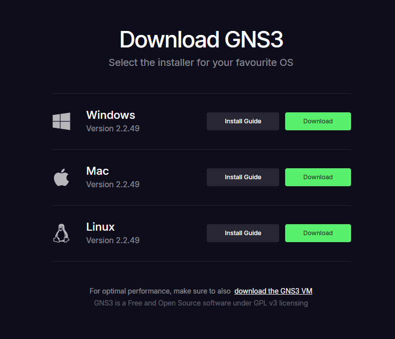
</p>


Para la instalación, dejamos todo por defecto, y cuando el programa pregunte si queremos comprar una licencia, elegimos la opción 'No'.

<p align="center">
  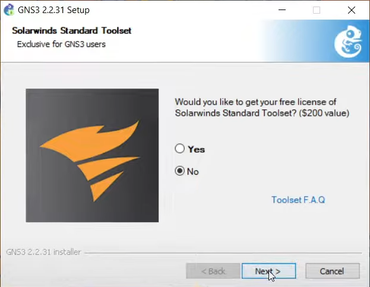
</p>

Además, debemos descargar una imagen para poder hacer algunas configuraciones del programa más adelante. Es para la configuración de un router Cisco 3660 (c3660).

> [!NOTE]
> El archivo se puede encontrar en la carpeta Documentos-Utiles.

Para no tener problemas, el archivo debe guardarse en la siguiente dirección:
 ```
C:
└── Usuarios
    └── <su_usuario>
        └── GNS3
            └── imagenes
               └── IOS
```

Aquí finaliza la instalación de GNS3.

### Instalacón de Oracle VirtualBox

Nos dirigimos a [la página de descarga de Oracle VirtualBox](https://www.virtualbox.org). Hacemos clic en el botón que dice 'Download' y seleccionamos el sistema operativo correspondiente a nuestra instalación.

<p align="center">
  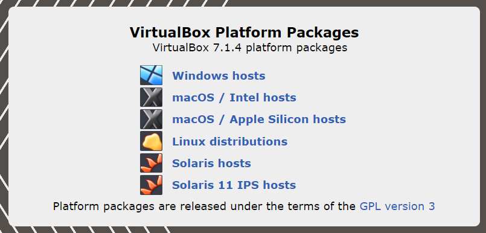
</p>

Dejamos toda la instalación por defecto y tendríamos VirtualBox instalado.

## Instalación de la máquinas virtuales

Debemos descargar una imagen, que sería el archivo ISO de nuestro sistema operativo. En este caso, usaremos Rocky Linux. Nos dirigimos [la página página principal de Rocky](https://rockylinux.org/es/download).

<p align="center">
  
</p>

Vamos a descargar el Boot ISO.

<p align="center">
  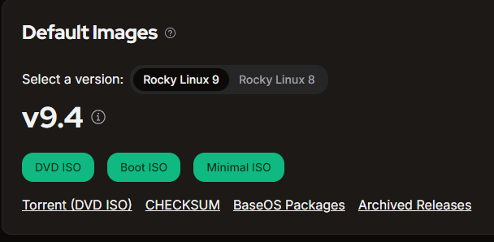
</p>

Para crear las máquinas virtuales, debemos ingresar a VirtualBox y hacer clic en el botón 'Nueva'.

En la pestaña 'Nombre y Sistema Operativo', debemos configurarlo de la siguiente forma: el nombre que queremos asignar a la máquina, la carpeta donde la queremos almacenar y seleccionar la imagen del sistema operativo. Lo demás lo dejamos por defecto.

<p align="center">
  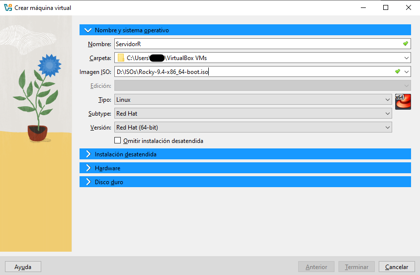
</p>

> [!IMPORTANT]
> - En la pestaña 'Instalación desatendida' se recomienda configurar solo el usuario y contraseña de la maquina.
> - En 'Hardware' se recomienda usar 4 CPUs.
> - En 'Disco duro' se puede dejar por defecto.

Cuando hagamos clic en 'Terminar', se abrirá la máquina y comenzará la instalación del sistema operativo. Cuando finalice la instalación, reinicia la máquina.

> [!NOTE]
> Debe hacer este proceso dos veces, ya que necesitamos una máquina para el 'Cliente' y otra para el 'Servidor'.

<p align="center">
  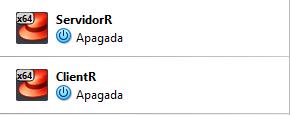
</p>

## Configuración del programa en GNS3

Dentro del programa creamos un proyecto y para la configuración, hay que seguir tres pasos:

* Crear un router.
* Añadir las máquinas virtuales.
* Programar el proyecto.

### Crear un router

Creamos un nuevo 'Template' y seleccionamos la opción que dice 'Manually create new template'. En la barra de la izquierda, seleccionamos la opción 'IOS routers'. Hacemos clic en 'New', seleccionamos la imagen que anteriormente debiamos descargar que se encuentra en la capeta 'Documentos-Utiles' y dejamos todo los demás por defecto.

<p align="center">
  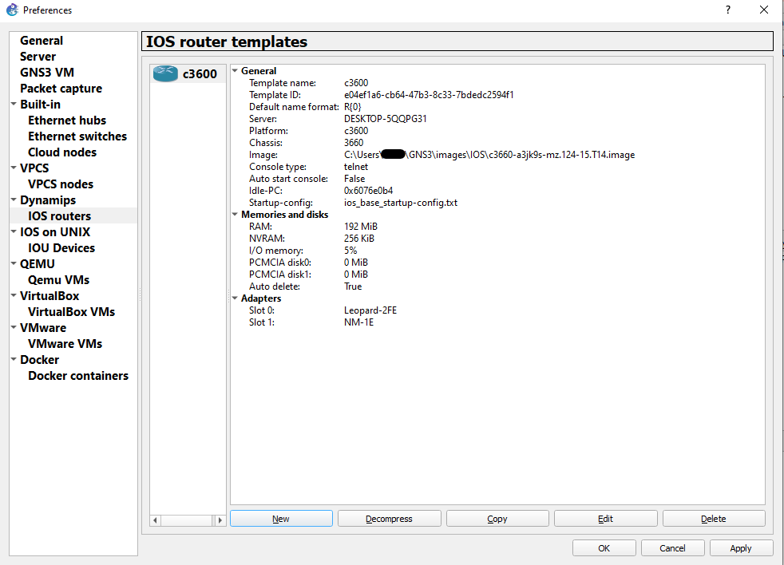
</p>

Cuando ya esté creadO , hacemos clic en 'Apply' y luego en 'OK'.

### Añadir máquinas virtuales

Creamos un nuevo 'Template' y seleccionamos la opción que dice 'Manually create new template'. En la barra de la izquierda, seleccionamos la opción 'VirtualBox VMs'. Hacemos clic en 'New' y el programa reconocerá automáticamente las máquinas virtuales. Seleccionamos el servidor y el cliente.

<p align="center">
  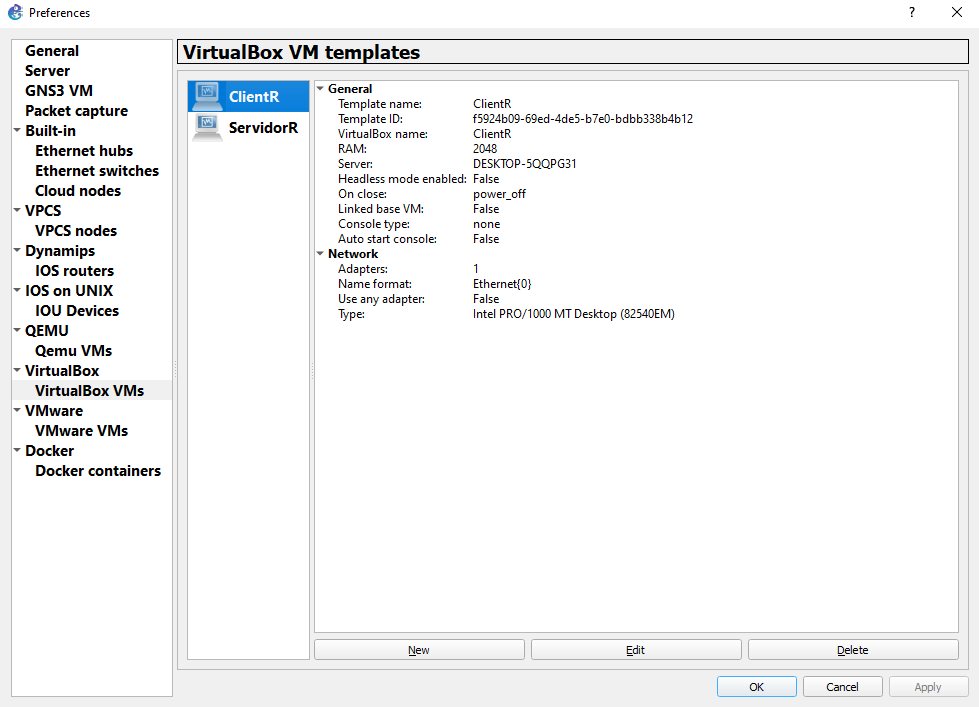
</p>

Cuando ya estén creadas las máquinas, hacemos clic en 'Apply' y luego en 'OK'.

### Programar el proyecto

Primero, debemos entrar a VirtualBox para configurar el adaptador de red de ambas máquinas. Seleccionamos la máquina, entramos en configuración, ponemos el modo 'Expert' y nos dirigimos a Red. Ahí, en 'Conectado a', seleccionamos NAT.

<p align="center">
  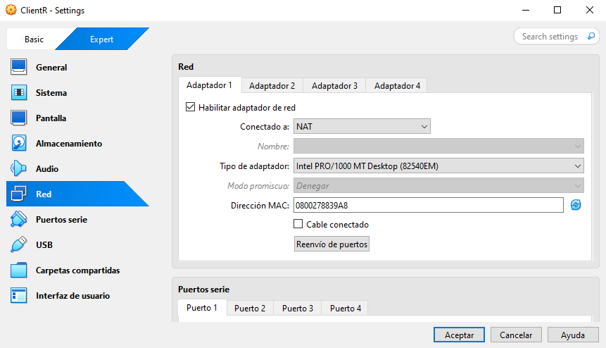
</p>

> [!IMPORTANT]
> Hacer esto con ambas maquinas antes de los siguientes pasos.

Después de configurar la red de las máquinas, nos dirigimos a GNS3. En la barra lateral izquierda, seleccionamos el tercer ícono que contiene todos los dispositivos. Arrastramos a la plantilla el router creado, las máquinas virtuales, un switch y un VPCS para pruebas. Los conectamos de la siguiente forma:

<p align="center">
  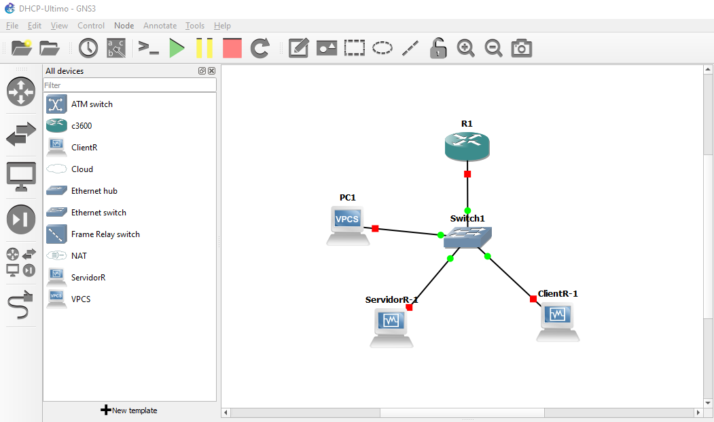
</p>

Para hacer la conexión, debemos seleccionar el último ícono de la barra de opciones de la izquierda (la que tiene forma de cable) y hacer clic desde el dispositivo hacia el switch, y luego seleccionar el puerto.

**Ahora debemos configurar el router**

Hacemos clic derecho en el router y seleccionamos la opción 'Start'. Después de que inicie, volvemos a hacer clic derecho y seleccionamos la opción de 'Consola'.

Dentro de la consola damos enter para iniciar.

<p align="center">
  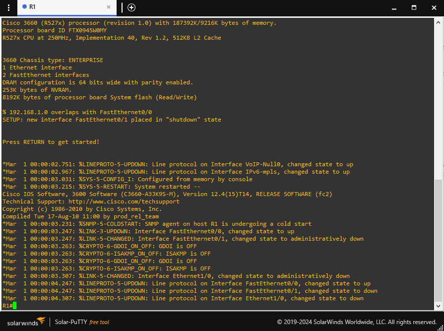
</p>

Ahora vamos a configurar una interfaz de red del router, en este caso, la primera. Para eso, debemos usar las siguientes líneas.

```
show ip interface brief
configure terminal
interface FastEthernet0/0
no shutdown
ip address 192.168.1.1 255.255.255.0
end
show ip interface brief
wr
```

Con esas líneas de comando, estamos:

* Mostrando las interfaces de red del router.
* Accediendo a la configuración de la primera interfaz.
* La encendemos.
* Le asignamos una IP con su máscara.
* Verificamos que se haya configurado correctamente.
* Guardamos.

Ahora volvemos a GNS3, le damos clic derecho a el equipo PC1 y lo iniciamos. Hacemos doble clic en el equipo, y nos dirigirá a la consola.

<p align="center">
  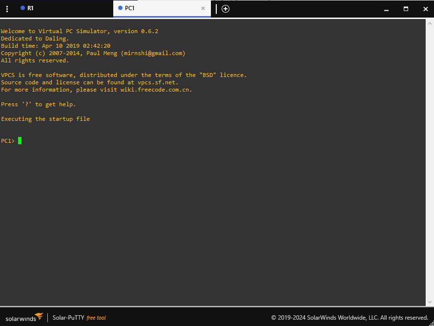
</p>

Le vamos a asignar una IP con un default gateway.

```
show ip 
ip address 192.168.1.2 255.255.255.0 192.168.1.1
ping 192.168.1.1
```

Con esas líneas de comando, estamos:

* Mostrando la Ip del dispositivo (No tiene).
* Le asignamos una con una máscara y el default gateway del router.
* Hacemos ping al servidor para ver si se conectó correctamente.

Si si el VPCS se conecta con el servidor correctamente, significa que no deberiamos tener inconveniente con la conexión de las maquinas virtuales.

## Configuración del código del proyecto

> [!IMPORTANT]
> Hacer el mismo procedimiento con ambas máquinas virtuales (cliente y servidor).

Accedemos a una de las máquinas virtuales. Entramos en la terminal y ejecutamos los siguientes comandos:

> [!NOTE]
> Estos comando sirven para el sistema operativo Ubuntu.

Debemos de instalar las siguientes dependencia en la máquina:
* vim
* git
* gcc
* g++
* CUnit
* CUnit-devel
* pkg-config
* python3
* cmake

```
sudo dnf update -y
sudo dnf config-manager --set-enabled crb
sudo dnf install -y vim git gcc gcc-c++ CUnit CUnit-devel pkg-config cmake
```

Debemos de clonar el repositorio en donde esta el programa. Y accedemos a la siguiente branch.

```
git clone https://github.com/julianvb03/DHCPv4.git
git checkout julian/dev
cd ./DHCPv4
```

Estando en la carpeta del programa, ejecutaremos los siguientes comandos para compilarlo.

```
cmake -S. -Bbuild
cd ./build
make
cd bin
```

```
DHCPv4:
└── build
    └── bin
        └── client.out
        └── server.out
```

Ahora tenemos ambos programas en ambas máquinas.

Cerramos las máquinas y debemos entrar a VirtualBox para configurar el adaptador de red de ambas máquinas. Seleccionamos la máquina, entramos en configuración, ponemos el modo 'Expert' y nos dirigimos a Red. Ahí, en 'Conectado a', seleccionamos No conectado.

<p align="center">
  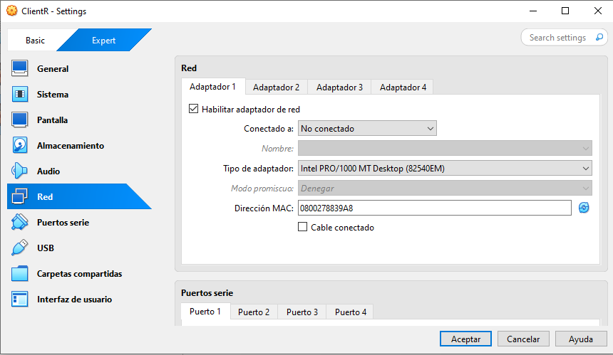
</p>

### Ejecución del proyecto

Nos dirigimos a GNS3 y hacemos clic en 'Start' en la parte superior del programa. Esto iniciará el router, el PC1 y las máquinas virtuales de forma automática. En las máquinas virtuales, procedemos a hacer lo siguiente en ambas máquinas:

```
sudo pkill dhclient
sudo pkill dhcpcd
sudo systemctl stop NetworkManager
sudo systemctl stop firewalld
sudo systemctl disable firewalld
```

Con esas líneas de comando, estamos:
* Desactivando cualquier proceso automático de DHCP.
* Desactivando cualquier cambio o manejo automático de interfaces de red por parte de NetworkManager.
* Desactivando temporalmente el firewall.
* Evitando que el firewall se active de forma automática.

> [!CAUTION]
> Los siguientes comandos solo se usan en la terminal del servidor.
> Se le asiganrá una IP estática y su gateway.

````
sudo ip addr add 192.168.1.2/24 dev enp0s3
sudo ip route add default via 192.168.1.1
````

#### Ejecución

Accedemos a la carpeta 'bin' en ambas terminales de las máquinas.
```
DHCPv4:
└── build
    └── bin
        └── client.out
        └── server.out
```

En la máquina del servidor, ejecutamos server.out y luego, en la terminal del cliente, ejecutamos cliente.out.

En el cliente usamos:

```
cd ./DHCPV4/build/bin
sudo ./client.out
```

En el servidor usamos:
```
cd ./DHCPV4/build/bin
sudo ./server.out enp0s3
```
